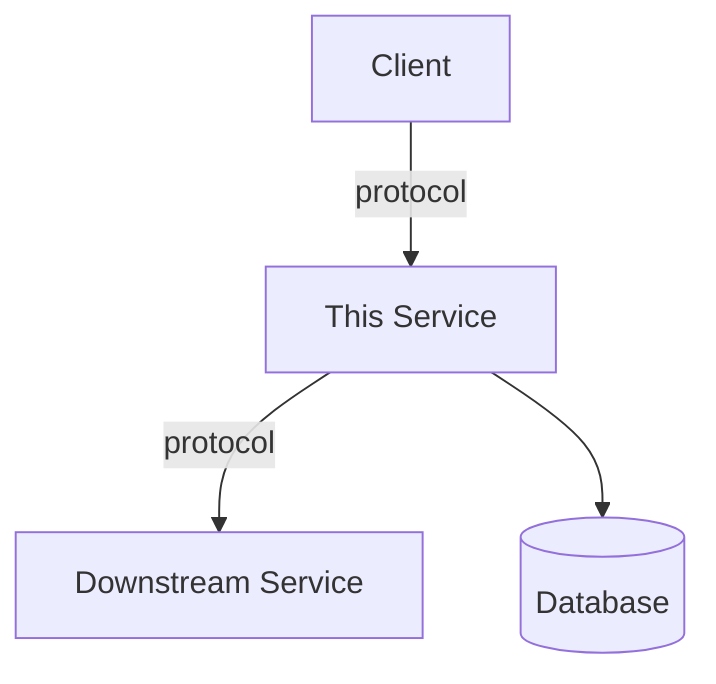
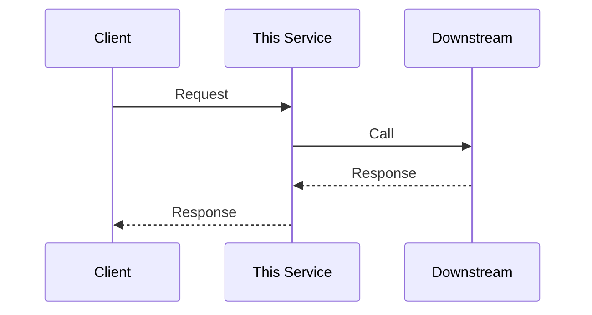
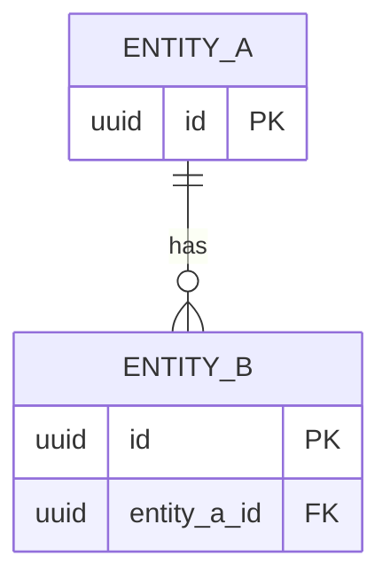

# Generate Service Documentation

## Overview

Systematic codebase analysis procedure that produces a complete service documentation file following the standard template. The agent explores the repository to discover language, framework, dependencies, APIs, data stores, messaging, infrastructure, and ownership — then synthesizes findings into a single markdown document with machine-readable YAML front-matter and Mermaid architecture diagrams.

## Constraints

- Never fabricate information. If a fact cannot be determined from the codebase, mark it as `# TODO: could not be determined — fill manually` in the output.
- Do not guess service names from directory names alone — cross-reference with package manifests, CI configs, and deployment descriptors.
- Do not invent upstream/downstream services. Only document connections that are evidenced in the code (HTTP clients, gRPC stubs, queue producers/consumers, config references).
- Every Mermaid diagram must reflect only discovered architecture — no aspirational components.
- The output file must be valid markdown with valid YAML front-matter.

## Analysis Phases

Execute phases sequentially. Each phase builds on prior findings. Record findings in a structured scratchpad before writing the final document.

---

### Phase 1: Project Identity

**Goal**: Determine service name, language, framework, version, and repository metadata.

| Source                                                                   | What to Extract                              | Tool |
| ------------------------------------------------------------------------ | -------------------------------------------- | ---- |
| `package.json`                                                           | name, version, dependencies, scripts         | Read |
| `pom.xml` / `build.gradle` / `build.gradle.kts`                          | groupId, artifactId, version, dependencies   | Read |
| `go.mod`                                                                 | module name, Go version, dependencies        | Read |
| `Cargo.toml`                                                             | package name, version, edition, dependencies | Read |
| `requirements.txt` / `pyproject.toml` / `setup.py` / `setup.cfg`         | project name, version, dependencies          | Read |
| `Gemfile` / `*.gemspec`                                                  | gem name, version, dependencies              | Read |
| `mix.exs`                                                                | app name, version, deps                      | Read |
| `*.csproj` / `*.sln`                                                     | project name, target framework, packages     | Read |
| `.tool-versions` / `.node-version` / `.python-version` / `.ruby-version` | Runtime versions                             | Read |
| `README.md`                                                              | Service description, badges                  | Read |
| `CLAUDE.md`                                                              | Project conventions, architecture notes      | Read |
| `git remote -v`                                                          | Repository URL                               | Bash |
| `git log --oneline -20`                                                  | Recent activity, contributors                | Bash |
| `git log --format='%aN' \| sort -u`                                      | Active contributors                          | Bash |

**Decision matrix — Language detection**:

| File Found                            | Language              | Typical Frameworks                      |
| ------------------------------------- | --------------------- | --------------------------------------- |
| `package.json`                        | JavaScript/TypeScript | Express, Fastify, NestJS, Next.js, Hono |
| `pom.xml` / `build.gradle`            | Java/Kotlin           | Spring Boot, Quarkus, Micronaut         |
| `go.mod`                              | Go                    | Gin, Echo, Fiber, net/http              |
| `Cargo.toml`                          | Rust                  | Actix, Axum, Rocket                     |
| `requirements.txt` / `pyproject.toml` | Python                | FastAPI, Django, Flask                  |
| `Gemfile`                             | Ruby                  | Rails, Sinatra                          |
| `mix.exs`                             | Elixir                | Phoenix                                 |
| `*.csproj`                            | C#                    | ASP.NET Core                            |

**Framework detection** — after identifying the language, grep dependencies for framework identifiers:

```
# JavaScript/TypeScript
grep -l "express\|fastify\|@nestjs\|next\|hono" package.json

# Java
grep -l "spring-boot\|quarkus\|micronaut" pom.xml build.gradle

# Python
grep -l "fastapi\|django\|flask" requirements.txt pyproject.toml

# Go
grep -l "gin-gonic\|echo\|fiber\|gorilla/mux" go.mod

# Rust
grep -l "actix-web\|axum\|rocket" Cargo.toml
```

---

### Phase 2: API Surface Discovery

**Goal**: Find all API endpoints, protocols, and authentication patterns.

| Strategy                    | Files to Search                                            | Pattern                                                                           |
| --------------------------- | ---------------------------------------------------------- | --------------------------------------------------------------------------------- |
| OpenAPI/Swagger spec        | `**/openapi.{yaml,yml,json}`, `**/swagger.{yaml,yml,json}` | Glob for spec files                                                               |
| Route definitions (Express) | `**/*.{ts,js}`                                             | `router\.(get\|post\|put\|patch\|delete)\|app\.(get\|post\|put\|patch\|delete)`   |
| Route definitions (Spring)  | `**/*.java`                                                | `@(Get\|Post\|Put\|Delete\|Patch\|Request)Mapping`                                |
| Route definitions (FastAPI) | `**/*.py`                                                  | `@app\.(get\|post\|put\|delete\|patch)\|@router\.(get\|post\|put\|delete\|patch)` |
| Route definitions (Go)      | `**/*.go`                                                  | `\.Handle\(?\|\.HandleFunc\|\.GET\|\.POST\|\.PUT\|\.DELETE\|\.Group`              |
| Route definitions (Rails)   | `config/routes.rb`                                         | `get\|post\|put\|patch\|delete\|resources\|resource`                              |
| Route definitions (ASP.NET) | `**/*.cs`                                                  | `\[Http(Get\|Post\|Put\|Delete\|Patch)\]`                                         |
| gRPC definitions            | `**/*.proto`                                               | `service\s+\w+\s*\{`                                                              |
| GraphQL schema              | `**/*.graphql`, `**/*.gql`                                 | `type Query\|type Mutation`                                                       |
| Auth middleware             | `**/*auth*`, `**/*middleware*`                             | `Bearer\|JWT\|OAuth\|apiKey\|session`                                             |
| Rate limiting               | All source files                                           | `rateLimit\|throttle\|rate.limit`                                                 |

**Endpoint extraction procedure**:

1. First check for OpenAPI spec — if found, it is the authoritative source.
2. If no spec, scan route files and build the endpoint table from code.
3. For each endpoint, determine: method, path, description (from comments/decorators), auth requirement.
4. Look for health check endpoints (`/health`, `/healthz`, `/ready`, `/readyz`, `/live`, `/livez`).
5. Look for metrics endpoints (`/metrics`, `/prometheus`).

---

### Phase 3: Dependency & Connection Discovery

**Goal**: Map all upstream callers, downstream services, datastores, and messaging systems.

#### 3a: Downstream Services (who we call)

| Signal                 | Where to Look                                    | Pattern                                                                             |
| ---------------------- | ------------------------------------------------ | ----------------------------------------------------------------------------------- |
| HTTP clients           | All source files                                 | `fetch\|axios\|HttpClient\|RestTemplate\|WebClient\|requests\.\|http\.Get\|reqwest` |
| gRPC stubs             | `**/*_grpc*`, `**/*_pb*`                         | Generated client stubs, `grpc.Dial\|ManagedChannelBuilder\|grpc.insecure_channel`   |
| Service URLs in config | `**/*.env*`, `**/application*.yml`, `**/config*` | `_URL=\|_HOST=\|_ENDPOINT=\|_SERVICE_`                                              |
| Service discovery      | All source files                                 | `consul\|eureka\|dns\.resolve\|SRV`                                                 |

For each downstream service found, determine:

- Service name (from URL variable name or host)
- Protocol (REST, gRPC, GraphQL)
- Purpose (inferred from code context)

#### 3b: Upstream Services (who calls us)

Upstream callers usually cannot be determined from the repository alone. Mark as `# TODO: fill in upstream callers` unless:

- An API gateway config is present in the repo
- An ingress/route config names specific callers
- README or docs mention callers

#### 3c: Data Stores

| Signal        | Where to Look                          | Pattern                                                          |
| ------------- | -------------------------------------- | ---------------------------------------------------------------- |
| PostgreSQL    | Config, source                         | `postgres\|pg\|psycopg\|DATABASE_URL.*postgres\|jdbc:postgresql` |
| MySQL         | Config, source                         | `mysql\|mysql2\|jdbc:mysql\|pymysql`                             |
| MongoDB       | Config, source                         | `mongodb\|mongoose\|MongoClient\|MONGO_`                         |
| Redis         | Config, source                         | `redis\|ioredis\|RedisTemplate\|REDIS_`                          |
| DynamoDB      | Config, source                         | `dynamodb\|DynamoDbClient\|@aws-sdk/client-dynamodb`             |
| Elasticsearch | Config, source                         | `elasticsearch\|elastic\|@elastic/elasticsearch`                 |
| SQLite        | Config, source                         | `sqlite\|sqlite3\|better-sqlite3`                                |
| Migrations    | `**/migrations/**`, `**/db/migrate/**` | Existence of migration files                                     |

For each datastore, determine:

- Technology and version (from dependency manifest)
- Purpose (from table/collection names or code context)
- Is it the primary store or a cache?

#### 3d: Messaging Systems

| Signal        | Where to Look  | Pattern                                                |
| ------------- | -------------- | ------------------------------------------------------ |
| Kafka         | Config, source | `kafka\|KafkaProducer\|KafkaConsumer\|kafkajs\|KAFKA_` |
| RabbitMQ      | Config, source | `amqp\|rabbitmq\|amqplib\|RABBIT_`                     |
| SQS           | Config, source | `sqs\|SQSClient\|@aws-sdk/client-sqs`                  |
| SNS           | Config, source | `sns\|SNSClient\|@aws-sdk/client-sns`                  |
| NATS          | Config, source | `nats\|nats\.go\|nats-io`                              |
| Redis Pub/Sub | Source         | `subscribe\|publish\|pubsub` (in Redis context)        |

For each messaging system, extract:

- Technology
- Topic/queue names (from code or config)
- Direction: producer, consumer, or both
- Event names/types if discernible

---

### Phase 4: Infrastructure Discovery

**Goal**: Document deployment topology, environments, and configuration.

| Source                                               | What to Extract                         | Tool        |
| ---------------------------------------------------- | --------------------------------------- | ----------- |
| `Dockerfile` / `*.dockerfile`                        | Base image, build steps, exposed ports  | Read        |
| `docker-compose.yml` / `docker-compose*.yml`         | Local service dependencies, ports       | Read        |
| `k8s/**`, `deploy/**`, `chart/**`, `helm/**`         | Replicas, resources, namespaces, probes | Read + Glob |
| `.github/workflows/*.yml`                            | CI/CD pipeline, deployment targets      | Read        |
| `.gitlab-ci.yml`                                     | CI/CD pipeline                          | Read        |
| `Jenkinsfile`                                        | CI/CD pipeline                          | Read        |
| `terraform/**`, `pulumi/**`, `cdk/**`                | Infrastructure definitions              | Glob        |
| `.env.example` / `.env.sample` / `.env.template`     | Environment variables (safe to read)    | Read        |
| `config/**`, `application*.yml`, `appsettings*.json` | Configuration structure                 | Read        |

**Environment variable extraction** — never read `.env` directly (may contain secrets). Instead:

1. Read `.env.example`, `.env.sample`, `.env.template`
2. Grep source code for `process.env.`, `os.environ`, `os.Getenv`, `Environment.GetEnvironmentVariable`
3. Read config files that reference environment variables
4. Build the env var table from these safe sources

---

### Phase 5: Ownership & Contacts Discovery

**Goal**: Identify the responsible team and individuals.

| Source                                                                    | What to Extract                      |
| ------------------------------------------------------------------------- | ------------------------------------ |
| `CODEOWNERS`                                                              | Owning team/individuals              |
| `package.json` → `author`, `contributors`                                 | Named contributors                   |
| `pom.xml` → `<developers>`                                                | Named developers                     |
| `.github/CODEOWNERS`                                                      | GitHub code owners                   |
| `git log --format='%aN <%aE>' \| sort \| uniq -c \| sort -rn \| head -10` | Most active contributors             |
| `README.md`                                                               | Team mentions, contact info          |
| CI/CD configs                                                             | Notification channels (Slack, email) |
| PagerDuty/OpsGenie configs in repo                                        | On-call rotation                     |

If ownership cannot be determined, mark fields as `# TODO: fill in ownership — could not be determined from codebase`.

---

### Phase 6: Documentation Assembly

**Goal**: Synthesize all findings into the final document using the output template below.

#### Output Template

Use this exact structure for the generated file. Fill each section with phase findings. Leave sections with no data as empty tables with a `<!-- TODO -->` comment.

````markdown
---
# ============================================================
# SERVICE METADATA — Machine-readable block for AI agents
# ============================================================
service_name: # kebab-case identifier
display_name: # Human-readable name
version: # Current deployed version
status: # production | staging | deprecated | decommissioned
tier: # tier-1 (critical) | tier-2 (important) | tier-3 (internal)
domain: # Business domain
bounded_context: # DDD bounded context (optional)
language: # Primary language and version
framework: # Primary framework and version
repository: # Source code URL
ci_cd: # CI/CD pipeline URL
monitoring_dashboard: # Grafana / monitoring URL
alerting_channel: # Slack channel for alerts
runbook: # Link to operational runbook
api_spec: # OpenAPI / AsyncAPI spec URL
sla:
  availability: # e.g., 99.95%
  p99_latency_ms: # e.g., 250
owner:
  team:
  team_slack:
  tech_lead: # Name <email>
  product_owner: # Name <email>
  engineering_manager: # Name <email>
  on_call_rotation: # PagerDuty / Opsgenie URL
dependencies:
  upstream:
    - service:
      protocol: # e.g., HTTPS / REST, gRPC, GraphQL
  downstream:
    - service:
      protocol:
  datastores:
    - name:
      type: # e.g., PostgreSQL 16, Redis 7, DynamoDB
      purpose:
  messaging:
    - name:
      type: # e.g., Apache Kafka, RabbitMQ, SQS
      topics: []
tags: []
last_reviewed: # YYYY-MM-DD
---

# {Display Name}

> One-sentence description of what this service does.

## Table of Contents

- [Service Overview](#service-overview)
- [Architecture Diagram](#architecture-diagram)
- [API Summary](#api-summary)
- [Data Model](#data-model)
- [Service Dependencies](#service-dependencies)
- [Event Contracts](#event-contracts)
- [Infrastructure](#infrastructure)
- [Development](#development)
- [Ownership & Contacts](#ownership--contacts)
- [Runbooks & Incident Response](#runbooks--incident-response)
- [ADRs & Design Decisions](#adrs--design-decisions)
- [Change Log](#change-log)

---

## Service Overview

| Attribute           | Value |
| ------------------- | ----- |
| **Domain**          |       |
| **Bounded Context** |       |
| **Tier**            |       |
| **Status**          |       |
| **Language**        |       |
| **Framework**       |       |
| **Repository**      |       |

### What It Does

<!-- Numbered list of core responsibilities -->

### What It Does NOT Do

<!-- Clarify boundaries. Reference other services where appropriate. -->

---

## Architecture Diagram



### Data Flow — Happy Path



---

## API Summary

| Method | Endpoint | Description | Auth |
| ------ | -------- | ----------- | ---- |
|        |          |             |      |

### Rate Limits

| Consumer | Requests/sec |
| -------- | ------------ |
|          |              |

---

## Data Model



---

## Service Dependencies

### Upstream (who calls us)

| Service | Protocol | Purpose |
| ------- | -------- | ------- |
|         |          |         |

### Downstream (who we call)

| Service | Protocol | Purpose | Failure Mode |
| ------- | -------- | ------- | ------------ |
|         |          |         |              |

### Data Stores

| Store | Technology | Purpose | Backup |
| ----- | ---------- | ------- | ------ |
|       |            |         |        |

---

## Event Contracts

| Event | Topic | Schema | Description |
| ----- | ----- | ------ | ----------- |
|       |       |        |             |

### Consumers

| Consumer | Topic(s) | Purpose |
| -------- | -------- | ------- |
|          |          |         |

---

## Infrastructure

### Deployment

| Environment | Cluster | Namespace | Replicas | CPU | Memory |
| ----------- | ------- | --------- | -------- | --- | ------ |
|             |         |           |          |     |        |

### Key Configuration (Environment Variables)

| Variable | Description | Default |
| -------- | ----------- | ------- |
|          |             |         |

---

## Development

### Prerequisites

<!-- List required tools, SDKs, and versions -->

### Local Setup

```bash
# Clone and run locally
```

### Branch & Release Strategy

<!-- Describe your branching model and release process -->

---

## Ownership & Contacts

| Role                    | Person / Team | Contact |
| ----------------------- | ------------- | ------- |
| **Owning Team**         |               |         |
| **Tech Lead**           |               |         |
| **Product Owner**       |               |         |
| **Engineering Manager** |               |         |
| **On-Call Rotation**    |               |         |

### Escalation Path

1. **L1**:
2. **L2**:
3. **L3**:

---

## Runbooks & Incident Response

| Scenario | Runbook |
| -------- | ------- |
|          |         |

### Key Metrics to Watch

<!-- List Prometheus/Datadog metric names and what they indicate -->

---

## ADRs & Design Decisions

| ADR | Title | Status | Date |
| --- | ----- | ------ | ---- |
|     |       |        |      |

---

## Change Log

| Version | Date | Author | Summary |
| ------- | ---- | ------ | ------- |
|         |      |        |         |
````

---

#### 6a: Generate YAML Front-Matter

Map discovered facts to front-matter fields:

| Field           | Source                                                        |
| --------------- | ------------------------------------------------------------- |
| `service_name`  | Package name, kebab-cased                                     |
| `display_name`  | Package name, title-cased                                     |
| `version`       | Package manifest version field                                |
| `status`        | Default `production` unless evidence of staging/deprecated    |
| `tier`          | Default `# TODO: set tier` — cannot be inferred               |
| `domain`        | Inferred from package name, directory structure, or README    |
| `language`      | Phase 1 detection                                             |
| `framework`     | Phase 1 detection                                             |
| `repository`    | `git remote` URL                                              |
| `ci_cd`         | CI config file location / URL                                 |
| `api_spec`      | OpenAPI spec path if found                                    |
| `owner`         | Phase 5 findings                                              |
| `dependencies`  | Phase 3 findings                                              |
| `tags`          | Extracted from README, package keywords, inferred from domain |
| `last_reviewed` | Today's date                                                  |

#### 6b: Generate Architecture Diagram

Build a Mermaid `graph TB` diagram with:

- **Upstream callers** at the top (if known)
- **This service** in the middle, with internal components if discernible (API layer, business logic, repository layer)
- **Downstream services** below
- **Data stores** at the bottom
- **Messaging systems** to the side
- Color-coded: service components in blue, messaging in orange, databases in their brand colors

#### 6c: Generate Sequence Diagram

If a primary happy-path flow can be determined (e.g., the main POST endpoint that calls downstream services), generate a Mermaid `sequenceDiagram` showing the call chain.

If the flow is unclear, generate a placeholder with a TODO comment.

#### 6d: Generate Data Model Diagram

If database migration files or ORM model definitions are found:

1. Extract entity names and key fields
2. Extract relationships (foreign keys, associations)
3. Generate a Mermaid `erDiagram`

If no models are found, include a TODO placeholder.

#### 6e: Fill Remaining Sections

For each template section, use the corresponding phase findings. Sections where data was not found get a TODO marker rather than being omitted — this signals to the human reviewer what still needs manual input.

---

## Output

A single markdown file at `services/<service-name>.md` following the standard template. The file must:

1. Have valid YAML front-matter between `---` delimiters
2. Include at least one Mermaid architecture diagram
3. Mark all undetermined fields with `# TODO:` comments
4. Not contain any fabricated information

After writing the file, print a summary to chat:

- File path
- What was successfully detected
- What requires manual completion (TODO count)

## Excuses vs. Reality

| Excuse the Agent Will Generate                              | Reality                                                                                                                       |
| ----------------------------------------------------------- | ----------------------------------------------------------------------------------------------------------------------------- |
| "The codebase is too large to analyze"                      | You don't need to read every file. Use Glob to find manifests and Grep to find patterns. 20-30 targeted reads are sufficient. |
| "I can't determine the service name"                        | Check the package manifest, git remote URL, Dockerfile labels, CI config, or directory name — in that priority order.         |
| "I'll skip the diagram because the architecture is complex" | Draw what you found. An incomplete but accurate diagram is better than no diagram.                                            |
| "I don't have enough info for the front-matter"             | Fill what you can, mark the rest as TODO. Partial metadata is still useful.                                                   |
| "I should ask the user for every unknown"                   | Only ask for things that truly cannot be inferred. Batch unknowns into a single question at the end.                          |

## When to Apply

| Scenario                           | Apply?                                                         |
| ---------------------------------- | -------------------------------------------------------------- |
| New service needs documentation    | Yes                                                            |
| Existing service doc needs refresh | Yes — read existing doc first, update with fresh analysis      |
| Monorepo with multiple services    | Yes — run once per service directory                           |
| Library (not a service)            | No — this skill is for deployed services with APIs/connections |
| Spike or prototype                 | No — too early for formal documentation                        |

## Guidelines

1. **Evidence-based only.** Every claim in the document must trace back to a file or command output in the repository.
2. **TODO over fiction.** When in doubt, leave a TODO. Never invent service names, endpoints, or connections.
3. **Prioritize the front-matter.** The YAML block is the primary interface for AI agents and tooling. Get it right first.
4. **Diagrams reflect reality.** Mermaid diagrams must match discovered architecture. No aspirational components.
5. **Safe config reading.** Never read `.env` files. Use `.env.example` and source code grep instead.
6. **Batch unknowns.** Collect all TODO items and present them as a single checklist at the end, not as interruptions during analysis.
7. **Incremental output.** Write the file early with partial findings, then refine. Don't spend 30 tool calls exploring before producing anything.
