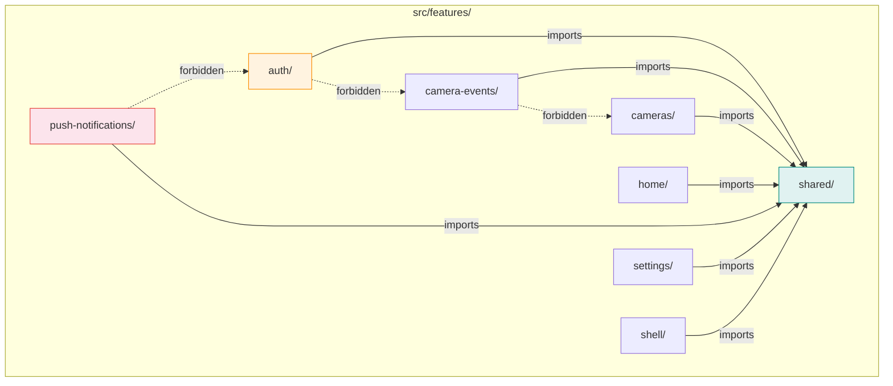
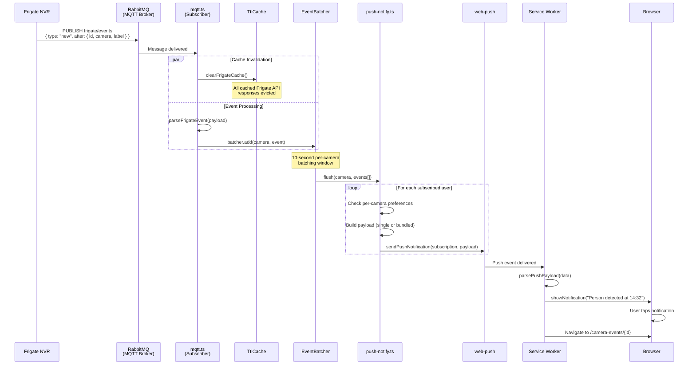
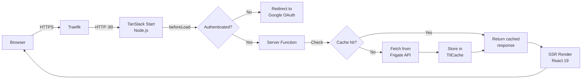
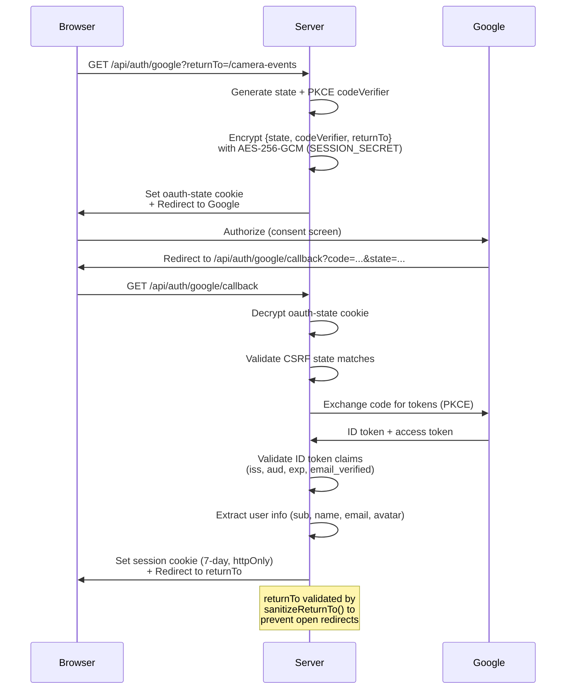
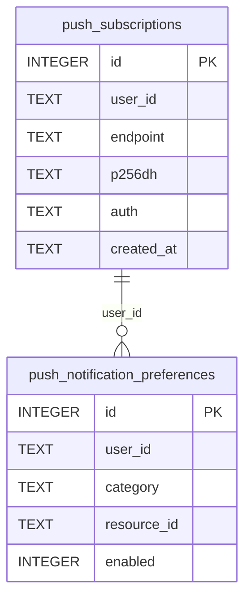
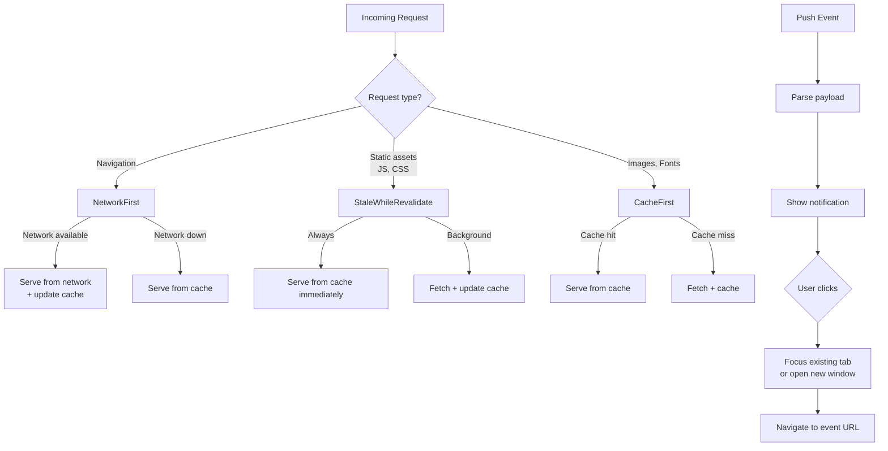
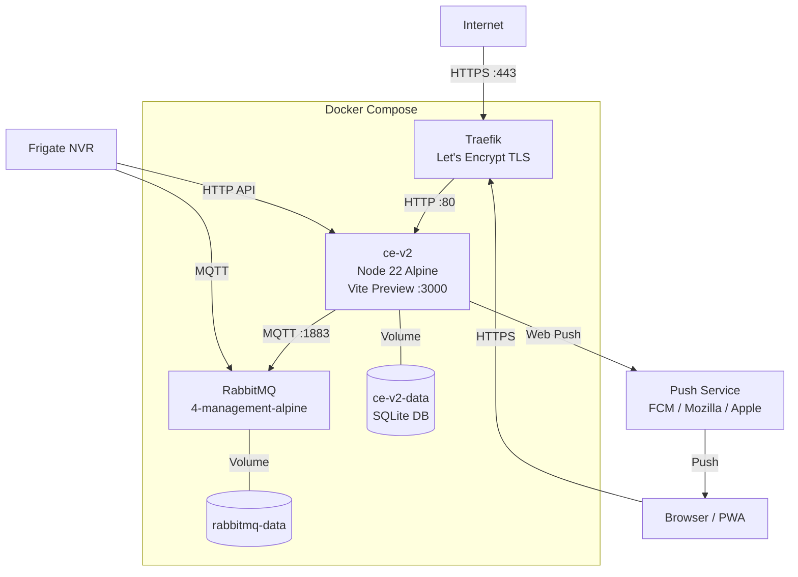

# Camera Events v2 — Architecture

## Overview

Camera Events v2 is a self-hosted web application that surfaces real-time security camera events from [Frigate NVR](https://frigate.video). It provides a responsive UI for browsing detection events (person, vehicle, animal), viewing snapshots and clips, and receiving push notifications when new activity is detected.

The system runs as two Docker containers behind a Traefik reverse proxy:

```
┌─────────────────────────────────────────────────────────────┐
│  Host (Docker Compose)                                      │
│                                                             │
│  ┌──────────┐    TLS    ┌──────────────┐   MQTT   ┌──────┐ │
│  │ Traefik  │◄────────► │   ce-v2      │◄────────►│Rabbit│ │
│  │ (proxy)  │  :443     │  (Node 22)   │  :1883   │  MQ  │ │
│  └──────────┘           │   :80        │          └──┬───┘ │
│       ▲                 └──────┬───────┘             │     │
│       │                        │ HTTP                │     │
│       │                        ▼                     │     │
│  ┌────┴────┐            ┌─────────────┐       ┌─────┴───┐ │
│  │ Browser │            │  Frigate    │       │ Frigate  │ │
│  │  (PWA)  │            │  NVR (API)  │──────►│  (MQTT)  │ │
│  └─────────┘            └─────────────┘       └─────────┘ │
└─────────────────────────────────────────────────────────────┘
```

**Key properties:**

- **SSR-first** — TanStack Start renders pages on the server; the client hydrates and takes over
- **Real-time** — MQTT messages from Frigate trigger cache invalidation and push notifications within seconds
- **Offline-capable** — Service worker precaches the app shell and caches API responses with tiered strategies
- **Self-contained** — SQLite for persistence, no external database service required

---

## Technology Stack

| Layer     | Technology                                 |
| --------- | ------------------------------------------ |
| Framework | TanStack Start (React 19, SSR)             |
| Routing   | TanStack Router (file-based)               |
| Build     | Vite 8                                     |
| Styling   | Tailwind CSS v4 (custom design tokens)     |
| Auth      | Google OAuth 2.0 (PKCE) via Arctic         |
| Session   | Encrypted cookies (vinxi/http)             |
| Database  | SQLite via better-sqlite3 (WAL mode)       |
| MQTT      | mqtt.js client → RabbitMQ broker           |
| Push      | web-push (VAPID), Service Worker (Serwist) |
| Testing   | Vitest, Storybook 10 (browser), Playwright |
| Runtime   | Node 22 Alpine, Docker Compose             |

---

## Feature-Sliced Architecture

The codebase follows a vertical feature-slice architecture. Each feature owns its components, hooks, server logic, and types. Cross-feature imports are forbidden — shared code lives in `src/features/shared/`.



| Feature               | Responsibility                                              |
| --------------------- | ----------------------------------------------------------- |
| `auth/`               | Google OAuth flow, session management, crypto               |
| `camera-events/`      | Event list, detail view, filters, formatting                |
| `cameras/`            | Camera grid with live snapshots                             |
| `home/`               | Public landing page, sign-in CTA                            |
| `push-notifications/` | MQTT subscriber, event batching, push delivery, SW handlers |
| `settings/`           | Event limit preference, notification settings UI            |
| `shell/`              | Header, nav, theme toggle, service worker registration      |
| `shared/`             | Frigate client, cache, session, types, reusable components  |

---

## The Heartbeat: Real-Time Event Flow

This is the core data pipeline — the "pulse" of the application. When a camera detects motion or an object, the event propagates from Frigate through the server to the user's browser in under a second.



### Stage-by-stage breakdown

**1. Frigate publishes** — When a camera detects an object (person, car, animal), Frigate publishes a JSON message to `frigate/events` and `frigate/reviews` on the MQTT broker.

**2. RabbitMQ delivers** — RabbitMQ (with the MQTT plugin) routes messages from the `amq.topic` exchange to the app's subscriber. Configured in `rabbitmq/rabbitmq.conf` with no anonymous access and 24-hour session expiry.

**3. mqtt.ts processes** — The subscriber (`src/features/push-notifications/server/mqtt.ts`) does two things in parallel on every message:

- **Clears the Frigate cache** so the next SSR page load fetches fresh data
- **Parses new events** and feeds them into the EventBatcher (only events with `type: "new"`)

**4. EventBatcher collects** — The batcher (`event-batcher.ts`) groups events by camera and holds them for a 10-second window. This prevents notification spam when a camera fires multiple detections in rapid succession (e.g., a person walking through a zone triggers 5 events in 3 seconds — the user gets one notification for all 5).

**5. push-notify.ts dispatches** — When the batching window closes, the flush callback:

- Queries all push subscriptions from SQLite
- Checks each user's per-camera notification preferences (opt-out model: no preference row = enabled)
- Builds a **single payload** (1 event) or **bundled payload** (2+ events) with title, body, icon URL, and click URL
- Sends to all of the user's registered devices

**6. Service Worker receives** — The push event handler in `src/sw.ts` parses the payload, constructs notification options (icon, badge, actions), and calls `showNotification()`.

**7. User interacts** — Tapping the notification uses `clients.openWindow()` or `clients.matchAll()` to focus an existing tab and navigate to the event detail page. The click URL is validated against open redirect attacks.

---

## SSR Request Flow

Every page load follows this path from browser to Frigate and back:



### Caching Layer

The Frigate API client (`src/features/shared/server/frigate/client.ts`) wraps all JSON responses in a `TtlCache`:

- **TTL**: 10 minutes per entry
- **Max entries**: 500 (LRU eviction when full)
- **Invalidation**: `clearFrigateCache()` is called on every MQTT message, so cached data is never more stale than the time between the MQTT event and the next page request
- **Exclusions**: Binary responses (thumbnails, snapshots, clips) bypass the cache

```
MQTT message arrives
       │
       ▼
clearFrigateCache()     ← all entries evicted
       │
       ▼
Next SSR request        ← cache miss → fresh Frigate fetch
       │
       ▼
Response cached         ← subsequent requests hit cache
       │
       ▼
10 min TTL expires      ← entry evicted naturally
```

---

## Authentication Flow

Google OAuth 2.0 with PKCE, encrypted state cookies, and open-redirect prevention:



**Security measures:**

- PKCE prevents authorization code interception
- AES-256-GCM encrypted state cookie (key derived from SESSION_SECRET via SHA-256)
- CSRF state parameter validated on callback
- ID token claims validated (issuer, audience, expiry, email_verified)
- `sanitizeReturnTo()` ensures redirect targets are relative paths only
- Session cookie: httpOnly, secure, SameSite=Lax, 7-day expiry
- SESSION_SECRET must be at least 32 characters

---

## Database Schema

SQLite with WAL mode, storing push subscription and notification preference data:



| Table                           | Purpose                                       | Uniqueness                               |
| ------------------------------- | --------------------------------------------- | ---------------------------------------- |
| `push_subscriptions`            | Stores Web Push endpoints per user per device | `UNIQUE(user_id, endpoint)`              |
| `push_notification_preferences` | Per-camera opt-out toggles                    | `UNIQUE(user_id, category, resource_id)` |

**Opt-out model**: No row in `push_notification_preferences` means notifications are enabled. Users explicitly disable cameras they don't want alerts from.

---

## Service Worker & Offline Strategy

The service worker (`src/sw.ts`) uses Serwist for precaching and runtime caching:



**Push notification handling in the SW:**

1. `parsePushPayload(data)` — extracts title, body, icon, click URL from the push event
2. `buildNotificationOptions(payload)` — constructs the notification with icon and actions
3. `getNotificationClickUrl(payload)` — returns the target URL, validated to prevent open redirects
4. On notification click: searches for an existing app window with `clients.matchAll()`, focuses it if found, otherwise opens a new window

---

## Deployment Topology



**Container details:**

| Service    | Base Image                     | Ports                           | Volumes               |
| ---------- | ------------------------------ | ------------------------------- | --------------------- |
| `ce-v2`    | `node:22-alpine`               | 3000 → 80 (internal)            | `ce-v2-data` (SQLite) |
| `rabbitmq` | `rabbitmq:4-management-alpine` | 1883 (MQTT), 15672 (management) | `rabbitmq-data`       |

**Environment variables** (configured in `docker-compose.yml`):

- `MQTT_URL` — Connection string to RabbitMQ MQTT broker
- `GOOGLE_CLIENT_ID` / `GOOGLE_CLIENT_SECRET` — OAuth credentials
- `SESSION_SECRET` — Key for session cookies and OAuth state encryption
- `FRIGATE_URL` — Base URL for Frigate HTTP API
- `FRIGATE_MOCK` — Enable mock Frigate client for development
- `VAPID_PUBLIC_KEY` / `VAPID_PRIVATE_KEY` / `VAPID_SUBJECT` — Web Push VAPID credentials
- `DNS_NAME` — Public hostname for Traefik routing

---

## Route Map

All routes are file-based under `src/routes/`:

| Route                       | Auth   | Description                                   |
| --------------------------- | ------ | --------------------------------------------- |
| `/`                         | Public | Landing page with sign-in CTA                 |
| `/camera-events`            | Yes    | Event list with label/camera filters          |
| `/camera-events/:id`        | Yes    | Event detail with snapshot, clip, metadata    |
| `/cameras`                  | Yes    | Camera grid with live snapshots               |
| `/settings`                 | Yes    | Event limit slider + notification preferences |
| `/api/auth/google`          | Public | OAuth initiation endpoint                     |
| `/api/auth/google/callback` | Public | OAuth callback endpoint                       |
| `/api/auth/logout`          | Public | POST — clears session                         |
| `/api/cameras/:name/latest` | Yes    | Proxy to Frigate latest snapshot              |
| `/api/events/:id/thumbnail` | Yes    | Proxy to Frigate event thumbnail              |
| `/api/events/:id/snapshot`  | Yes    | Proxy to Frigate event snapshot               |
| `/api/events/:id/clip`      | Yes    | Proxy to Frigate event clip                   |
| `/api/push/*`               | Yes    | Push subscription management endpoints        |

The `_authenticated.tsx` layout route guards all protected routes — unauthenticated requests redirect to `/api/auth/google?returnTo=<path>`.

---

## Design Tokens

Tailwind CSS v4 with CSS custom properties for theming (light/dark/auto):

| Token                       | Purpose                  |
| --------------------------- | ------------------------ |
| `--sea-ink`                 | Primary text             |
| `--sea-ink-soft`            | Secondary text           |
| `--sea-accent`              | Interactive accent color |
| `--lagoon-deep`             | Active/selected state    |
| `--surface`                 | Card/panel background    |
| `--chip-bg` / `--chip-line` | Filter pill styling      |
| `--island-bg`               | Hero section background  |

Theme is set via a `<script>` in `__root.tsx` that reads `localStorage` before paint, preventing flash-of-wrong-theme.
